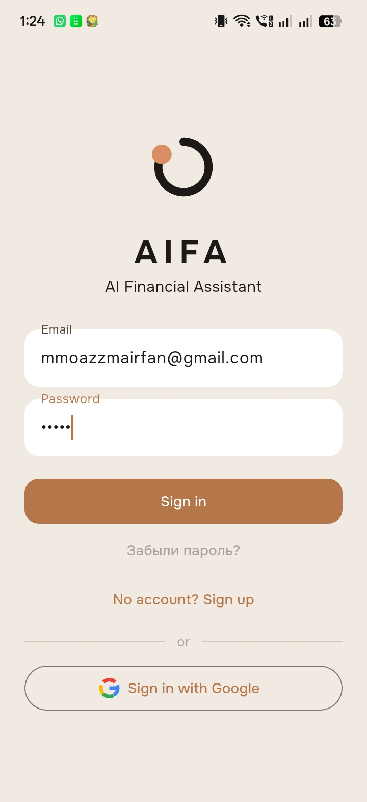
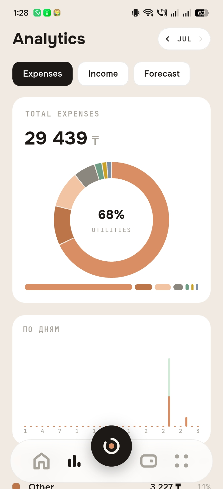

# AIFA – AI Financial Assistant

AIFA is an AI-powered financial assistant that helps users manage their personal finances through natural language conversations.

Users can record income, expenses, debts, and financial goals simply by chatting with the bot. The system uses AI to understand user requests, stores financial data securely, and automates financial workflows.

## Features

* AI-powered natural language understanding
* Income and expense tracking
* Debt management
* Financial goal tracking
* Voice message transcription
* Telegram chatbot interface
* Intelligent finance-aware To-Do management

# My Contributions

This was a **team project**, and I was responsible for designing and implementing the **Intelligent To-Do List** module.

### Intelligent To-Do System

I implemented a smart task management system integrated with the financial assistant.

### Features I Developed

* Implemented task creation using natural language commands.
* Built CRUD operations for task management (Create, Read, Update, Delete).
* Implemented one-time and recurring reminders.
* Integrated task completion with the financial transaction system.
* Automatically recorded expenses or income when financial tasks were completed.
* Implemented support for finance-linked and non-financial tasks.
* Added automatic transaction categorization for financial tasks.
* Implemented overdue task handling and completion timestamp logging.
* Integrated the feature with Telegram, n8n workflows, and Supabase.

## Technologies

* Python
* n8n
* Supabase
* PostgreSQL
* OpenAI API
* Telegram Bot API
## Project Status

Team Project

# 📸 Screenshots

## Welcome Screen

The welcome interface of the AIFA in app

---

## Main Chat Interface

Users interact with the assistant using natural language.

---

## Expense Tracking

Users can record expenses through simple chat messages.

---

## Income Tracking

Users can record income transactions naturally.

---

## Add Task

Users can create finance-aware tasks with reminders.

---

## Task Completion

When a finance-related task is completed, the expense is automatically recorded.

---

## Analytics

The assistant provides financial insights and analytics.

---

## n8n Workflow

This n8n workflow automates task creation, reminders, and financial transaction logging by integrating Telegram, OpenAI, and Supabase.

(Add the public application link if you have permission to share it.)

